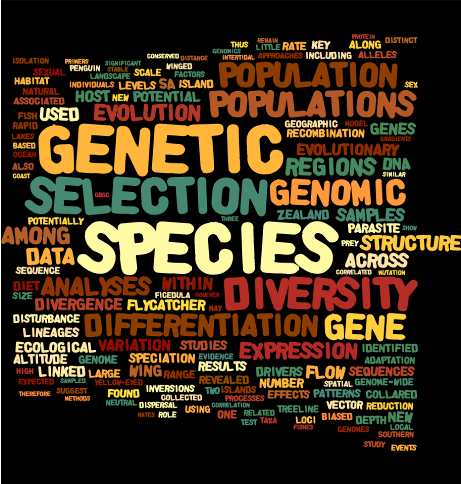

## Selected Publications

1)	Ruzicka, F., **Dutoit, L.1**, Czuppon, P., Jordan, C. Y., Li, X.-Y., Olito, C. & others (2020). The search for sexually antagonistic genes: Practical insights from studies of local adaptation and statistical genomics. *Evolution Letters**, 4(5), 398-415 [Link](https://onlinelibrary.wiley.com/doi/full/10.1002/evl3.192)

2)	Young, M. J., **Dutoit, L.**, Robertson, F., van Heezik, Y., Seddon, P. J., & Robertson, B. C. (2020). Species in the faeces: DNA metabarcoding as a method to determine the diet of the endangered yellow-eyed penguin. *Wildlife Research*, 47(6), 509-522. [Link](https://www.publish.csiro.au/WR/WR19246)  [NZ Geographic coverage](https://www.nzgeo.com/stories/hoiho-need-to-eat-better/)

3)	Cole, T. L., **Dutoit, L.**, Dussex, N., Hart, T., Alexander, A., Younger, J. L., Clucas, G. V., Frugone, M. J., Cherel, Y., Cuthbert, R., & others. (2019). Receding ice drove parallel expansions in Southern Ocean penguins. *Proceedings of the National Academy of Sciences*, 116(52), 26690–26696. [Link](https://www.pnas.org/content/116/52/26690.short)

4)	**Dutoit, L.**, Mugal, C., Bolívar, P., Wang, M., Nadachowska-Brzyska, K., Smeds, L., Gustafsson, L., & Ellegren, H. (2018). Sex-biased gene expression, sexual antagonism and levels of genetic diversity in the collared flycatcher (*Ficedula albicollis*) genome. *Molecular Ecology*, 27(18), 3572–3581. (From the cover) [Link](https://onlinelibrary.wiley.com/doi/full/10.1111/mec.14789)  [News and Views Article](https://onlinelibrary.wiley.com/doi/10.1111/mec.14787)

5)	**Dutoit, L.**, Vijay, N., Mugal, C. F., Bossu, C. M., Burri, R., Wolf, J., & Ellegren, H. (2017). Covariation in levels of nucleotide diversity in homologous regions of the avian genome long after completion of lineage sorting. *Proceedings of the Royal Society B: Biological Sciences*, 284(1849), 20162756. [Link](https://royalsocietypublishing.org/doi/10.1098/rspb.2016.2756)

6)	**Dutoit, L.**, Burri, R., Nater, A., Mugal, C. F., & Ellegren, H. (2017). Genomic distribution and estimation of nucleotide diversity in natural populations: Perspectives from the collared flycatcher (*Ficedula albicollis*) genome. *Molecular Ecology Resources*, 17(4), 586–597. (From the cover) [Link](https://onlinelibrary.wiley.com/doi/10.1111/1755-0998.12602) [[News and Views Article]](https://onlinelibrary.wiley.com/doi/10.1111/1755-0998.12632)

1 These authors contributed equally

You can find a full list of my publications on <a href="https://scholar.google.com/citations?user=RS3wR_UAAAAJ&hl=en&oi=ao">my Google Scholar profile</a>.

## Journal Covers

I have been lucky enough to have some of the research involved in featured on the cover of Molecular Ecology and Molecular Ecology Ressources

../men.2017.17.issue-4.cover.jpg]

../mec.2018.27.issue-18.cover.jpg]

../mec.v28.13.cover.jpg

## Word cloud

<html class="gr__ldutoit_github_io"><head></head><body data-gr-c-s-loaded="true">
    

</body></html>

This World cloud is based on all the abstracts of my publications.
